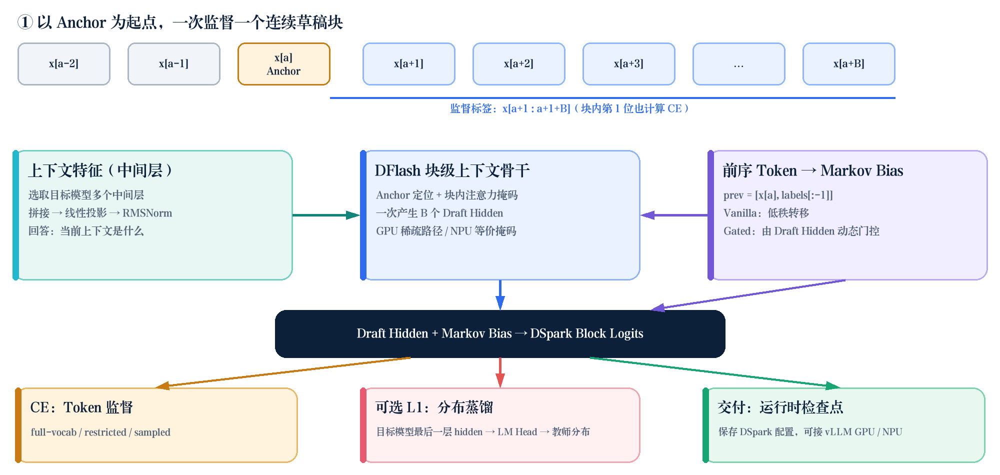
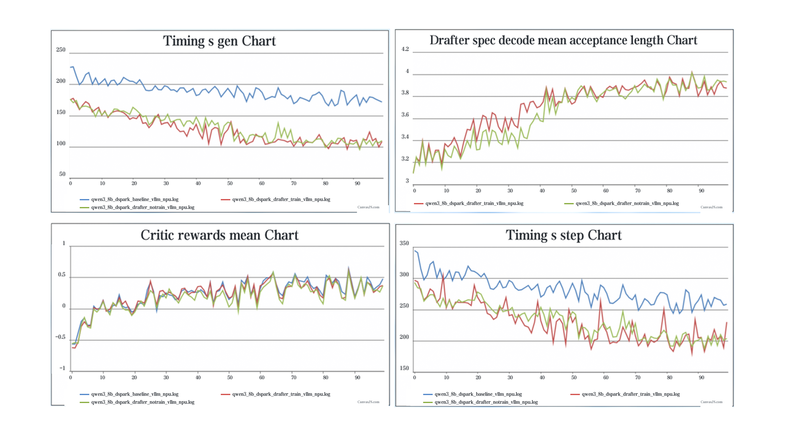
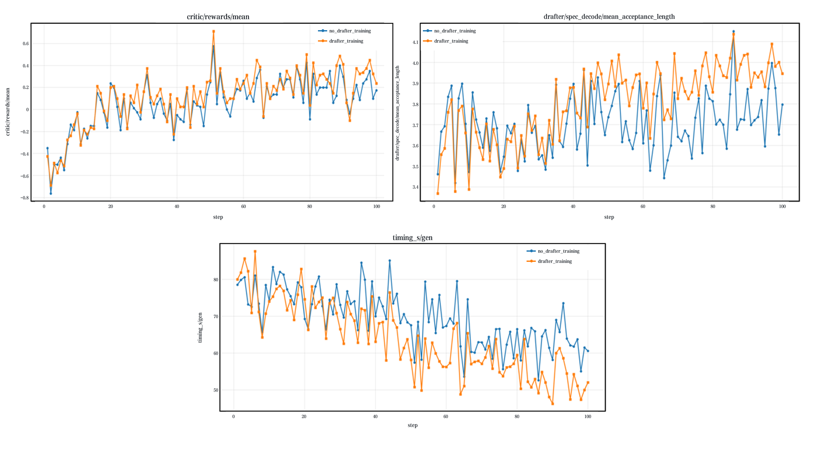
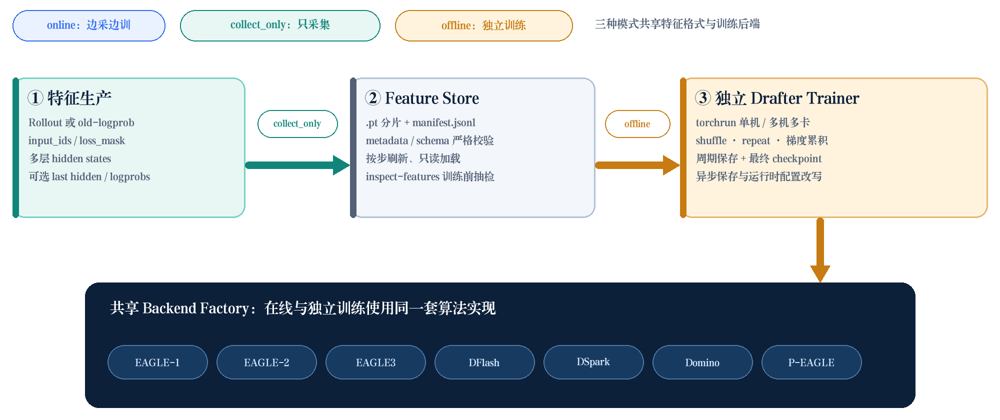

## 1. Overview

verl-SpeCo 0.1.0 advances draft model training along three major fronts:

First, it integrates the complete DSpark training and speculative decoding pipeline, resolving the semantic mismatch between conventional token-wise training and block-wise prediction.

Second, it introduces a standalone draft model training workflow with three modes—online training, feature collection only, and offline training—so draft models can be trained independently of a full reinforcement learning job.

Third, it expands algorithm coverage to seven widely used draft model families: DSpark, EAGLE-1, EAGLE-2, EAGLE3, DFlash, Domino, and P-EAGLE. It also supports both vLLM and SGLang inference runtimes across GPU and Ascend NPU backends.

The goal of this release is to provide native training support for advanced draft algorithms such as DSpark, establish complete workflows for both online co-training and standalone training, and broaden support for speculative decoding algorithms. The sections below walk through the four key areas of the release.

## 2. DSpark: Native Training for Block-Wise Speculative Decoding

### 2.1 Training Semantics Designed for DSpark's Block-Wise Predictions

DSpark uses block-wise generation to overcome performance limitations in conventional draft models. verl-SpeCo 0.1.0 introduces a dedicated DSpark training backend. During training, it starts from an anchor token in the sequence, constructs a fixed-length draft block, and aligns the anchor, preceding tokens, target tokens, and valid positions with DSpark's semantics. This allows even the first position in each block to contribute to the training objective.

This purpose-built data layout eliminates the semantic mismatch between generic token-wise training and DSpark's block-wise generation. The anchor, preceding tokens within the block, and supervised positions seen during training now match those used at inference time, providing a sound foundation for improving block-wise draft model performance.

### 2.2 Markov Heads for Explicit Intra-Block Token Dependencies

Unlike approaches that predict draft tokens solely from backbone hidden states, DSpark adds a Markov bias to the base logits, directly incorporating preceding tokens within the block into subsequent token predictions.

The verl-SpeCo training path supports two types of Markov Head: Vanilla and Gated. The Vanilla Head models dependencies between adjacent tokens through a low-rank token transition structure. The Gated Head additionally uses the hidden state at the current position to control the Markov signal dynamically. Markov bias works with full-vocabulary, restricted-CE, and sampled-CE computation paths. For restricted-CE and sampled-CE training, only the required output rows are selected while DSpark's transition modeling is preserved.

### 2.3 Joint Optimization with Cross-Entropy and Distribution Distillation

DSpark training can combine target-token cross-entropy with distribution distillation. The latter reconstructs the full output distribution from the target model's final-layer hidden states and computes the L1 distance between the draft and target distributions. The two losses can be weighted independently and decayed exponentially by position within the block, placing greater emphasis on the early positions that matter most for longer acceptance sequences.

To support L1 distribution distillation, verl-SpeCo extends the rollout/actor feature collection pipeline. In addition to multi-layer context features, it captures the target model's final-layer hidden states. The training backend then aligns them precisely with the label position of each anchor. This enables DSpark to optimize both token prediction accuracy and distributional consistency. Compared with training on token labels alone, this objective is better aligned with the acceptance-length decisions made during speculative decoding and helps the draft output more closely match the target model.

For large vocabularies, restricted CE and sampled CE reduce LM Head computation. When L1 distillation is enabled, the training backend can still reconstruct the full probability distribution on demand. verl-SpeCo also provides fine-grained diagnostics for identifying data issues and convergence problems in block-wise draft model training. It can truncate invalid position sequences, filter non-finite losses such as NaN and Inf, report loss and accuracy by block position, and track Top-1/Top-5 accuracy, valid token counts, and the sampled vocabulary size used by CE.

*Figure: DSpark training workflow*

### 2.4 Dedicated GPU and NPU Optimizations

DSpark builds on DFlash's block-wise context backbone. The training backend selects the attention implementation according to the device: CUDA uses a block mask with the Flex Attention path, while non-CUDA devices use an equivalent dense attention mask. This preserves sparse block computation on GPUs while providing an executable compatibility path for Ascend NPUs.

For inference, users set `speculative_algorithm=DSPARK`. On GPUs, this maps to vLLM's native DSpark method. On NPUs, integration follows the compatible vLLM and vLLM-Ascend versions specified in the project README.

*Figure: DSpark experiment results on NPU*

*Figure: DSpark experiment results on GPU*

## 3. Standalone Training: Decoupling Draft Model Training from the Main RL Job

### 3.1 Three Training Modes

In addition to online co-training, verl-SpeCo now supports standalone draft model training. Given a feature dataset produced by the target model, users can independently train any supported draft model, including EAGLE, DSpark, and DFlash. This makes it possible to build draft models for target models such as Qwen and Llama without running a complete RL job.

verl-SpeCo 0.1.0 divides draft model training into three modes: `online`, `collect_only`, and `offline`. The `online` mode preserves the existing co-training experience: it collects features in a PPO/Ray job, trains periodically, and can publish updated weights to the rollout engine. The `collect_only` mode writes collected features to the Feature Store without starting draft model training inside the RL job. The `offline` mode reads persisted features and runs draft model training as a separate job.

This separation decouples resource scheduling and draft model training from a single long-running pipeline. Feature generation and draft model experiments can run independently, and collected features can be reused for hyperparameter comparisons, architecture validation, and reproducible debugging. Dedicated training resources can also be provisioned outside the RL workflow.

### 3.2 Feature Store: Persistent Training Features

verl-SpeCo provides a Feature Store based on sharded PyTorch files. It persists input IDs, loss masks, target hidden states, and auxiliary features in shards while maintaining a unified schema and shard manifest. The collection side supports step-based flushing and shard-capacity controls. The training side provides read-only loading, sample shuffling, cyclic iteration, and strict schema validation, helping prevent failures caused by missing fields, shape drift, or configuration mismatches.

The release also adds the `verl-speco-inspect-features` command, which samples and validates stored features before training begins. Its strict exit codes make it suitable for automated pipelines, allowing users to verify data quality before committing training resources.

### 3.3 Distributed Training

verl-SpeCo adds the `verl-speco-draft-train` command and the `draft_trainer.yaml` top-level configuration. The launcher normalizes single-node multi-GPU and multi-node parameters, and automatically selects a single-node distributed torchrun configuration when appropriate. The offline training loop initializes the distributed environment, selects a Drafter Backend, reads from the Feature Store, performs gradient accumulation, saves checkpoints at configured intervals, and writes the final checkpoint.

Standalone training uses the same Drafter Backend interface as online co-training. The project currently includes training backends for EAGLE-1, EAGLE-2, EAGLE3, DFlash, DSpark, Domino, and P-EAGLE.

For observability, the training loop records loss, vloss, ploss, the current learning rate, and cumulative optimizer steps. Block-wise algorithms such as DFlash, DSpark, and Domino additionally expose CE/L1 loss, Top-1/Top-5 accuracy, valid token counts, sampled vocabulary size, loss and accuracy by block position, and timing for batch preparation, forward computation, loss reduction, backward propagation, and optimizer updates.

### 3.4 Getting Started

verl-SpeCo includes the `run_qwen3-8b_drafter_separate_training.sh` example script to demonstrate the standalone workflow in two stages. In the first stage, rollout runs in `collect_only` mode and writes features to a specified directory. In the second stage, the standalone trainer runs in `offline` mode, reads from the same Feature Store, and trains the draft model. To get started, users only need to replace the target model, draft model, dataset, feature directory, and checkpoint directory.

*Figure: Standalone training data loop*

## 4. Broader Support Across Algorithms and Runtimes

### 4.1 Seven Draft Model Training Backends

In addition to DSpark, verl-SpeCo 0.1.0 supports EAGLE-1, EAGLE-2, EAGLE3, DFlash, Domino, and P-EAGLE. EAGLE-1 and EAGLE-2 reuse vLLM's native EAGLE draft method, with EAGLE-2 adding dynamic tree decoding. Domino is trained as a DFlash projector sub-mode and deployed through a DFlash runtime that supports the Domino projector.

### 4.2 vLLM, SGLang, GPU, and NPU Examples

On the inference side, vLLM support covers EAGLE-1, EAGLE-2, EAGLE3, DFlash, and DSpark, while SGLang support covers EAGLE3 and DFlash. The project provides launch examples for both GPUs and NPUs. Graph modes, draft-model parameters, and version requirements remain explicit in the configuration, making each hardware setup easier to verify and reproduce.

| Algorithm | Online Co-Training | Standalone Training | vLLM | SGLang |
| --- | :---: | :---: | :---: | :---: |
| EAGLE-1 | Supported | Supported | Supported | — |
| EAGLE-2 | Supported | Supported | Supported | — |
| EAGLE3 | Supported | Supported | Supported | Supported |
| DFlash | Supported | Supported | Supported | Supported |
| DSpark | Supported | Supported | Supported | — |
| Domino | Supported | Supported | Compatibility mode | — |
| P-EAGLE | Supported | Supported | — | — |

*Table: Training, standalone training, and rollout runtime support across seven algorithms*

## 5. A Unified, Non-Intrusive Architecture

Beyond the two headline capabilities, verl-SpeCo 0.1.0 establishes a foundation for continued expansion. It is compatible with verl `release/v0.8.0` and ships as a separate package that provides layered Hydra configuration, training Workers, and rollout adapters without modifying the installed verl source code. The inference side supports vLLM and SGLang, with examples for GPUs and NPUs. The training side uses a unified FSDP backend and extends support for draft models through pluggable backends.

At runtime, the framework records drafter training time, weight publication time, and vLLM speculative decoding acceptance metrics, including `mean_acceptance_length`. This gives users visibility into both draft model learning and end-to-end rollout performance.

## 6. What's Next

verl-SpeCo 0.1.0 addresses the challenge of integrating draft models reliably into reinforcement learning workflows. Native DSpark integration broadens support for block-wise speculative decoding, while standalone training provides more flexible ways to organize feature collection and model optimization resources.

Future work will focus on end-to-end training and runtime support for additional draft algorithms, multi-hardware validation for standalone training, performance optimization, stronger feature storage and data governance, and more systematic benchmarking and observability.

